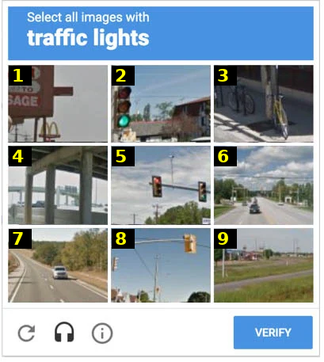

# 🌳 prima-ratio

**Text or images in. Text or typed decisions out.**

Both a calibrated **System One** — like Jev, running locally with no external
APIs — and a very capable chat model with tool-calling support, in a single
16 GB VRAM package.

Point it at a message, a record, or a photo, ask your questions, and read the
answers as **typed decisions with probabilities**, straight off the model —
no generation, no parsing, no captioning. Confidence you can classify, verify
and gate on.

It ships as **one Docker image, one engine in VRAM**: pull, run, done — the
image sets itself up on first start, serving **image-conditioned decisions**,
**typed text decisions** (yes/no, multiple-choice, scores) and **normal chat
completions** on the same weights.
API-compatible with TypeSafe's System One / Jev pattern.

Independent project; not affiliated with TypeSafe, Jev or SemIf.

  

---

## 💪 Strengths

- 👁️ **Image support, natively.** Send a photo instead of a state string: the
  same typed decisions work on images, probabilities read straight off the
  model — **no captioning step in between**. Nine CAPTCHA squares in one
  request, 2.2 s — and visual workloads calibrate like any other.
- 🔑 **Turn-the-key System One.** Pull, run, ask: typed decisions with
  probabilities from the very first call — no prompt engineering, no answer
  parsing, no JSON repair, no retry loops.
- 🎚️ **Super easy custom calibration.** A few dozen labeled examples and one
  HTTP call re-scale the confidence on *your* workload — with honest
  out-of-fold numbers to back it. No machine-learning expertise required.
- 🏷️ **Calibrated systems served automatically (MLOps).** Every calibrated
  workload becomes its own model name at runtime: create, call, and delete
  variants while the server keeps them all served side by side.
- 🎁 **System One + chat on one VRAM budget.** The same resident model answers
  typed decisions *and* OpenAI-shaped chat with tool calling — decisions for
  your pipelines, conversation for everything else, zero extra memory.
- 💻 **Low-spec friendly.** Runs on a mainstream 16 GB NVIDIA card — no need
  for the latest architectures — and eventually on the CPU as well
  *(roadmap: a 4B engine selected by one flag, for fast and CPU inference)*.

---

## 🚀 Quick Start (NVIDIA GPU)

🐳 **Ready-to-use image** on ghcr — no clone, no build:

```bash
docker run -d --gpus all -p 8000:8000 --restart unless-stopped \
  -v prima-cache:/cache \
  ghcr.io/andrea-tomassi/prima-ratio:latest
curl http://localhost:8000/v1/models
```

- 💾 **Persistent cache** *(optional, strongly recommended)*: mount a folder or
  volume at `/cache` as above — the engine (~12 GB) downloads once, on first
  start, and is reused on every restart. Without it, each new container
  re-downloads.
- ✅ **Requires an NVIDIA GPU with 16 GB** and the
  [NVIDIA container toolkit](https://docs.nvidia.com/datacenter/cloud-native/container-toolkit/latest/install-guide.html).
- 🧭 **Other ways to run it** — from source, custom CUDA builds, long contexts:
  **[RUNNING.md](RUNNING.md)**.
- 🏷️ **Versioned images** — every release also tags its version
  (`ghcr.io/andrea-tomassi/prima-ratio:0.3.2`); changelogs and history:
  **[Releases](https://github.com/andrea-tomassi/prima-ratio/releases)**.

---

## 👁️ Demo — nine questions, one image, one request

A reCAPTCHA-style challenge (*select all images with traffic lights*), nine
labeled squares, all nine questions in a single request — the image is encoded
once and every option logit is read against it:

| square | P(traffic light) | what it is |
|---|---|---|
| 2 | **0.98** | clear green signal |
| 5 | **0.96** | signals on the overhead arm |
| 8 | **0.79** | hanging yellow signal housing |
| 3 | 0.38 | bicycle + pole — the ambiguous one |
| 1 | 0.13 | signs and poles |
| 4 · 6 · 7 · 9 | 0.001 | clean negatives |

**9/9 against the visual ground truth, 2.2 s for all nine questions.** The
confidence behaves like a human's: sharp where the signal is obvious, hesitant
exactly where a person squints, rock-solid on clean negatives. *(Raw model
output — no visual calibration fitted.)*



### 🛠️ Use it

Vision is part of the default engine — just send the image as a content part;
chat and decisions both understand it:

```json
{"state": [{"type": "text", "text": "Inspect the receipt."},
           {"type": "image_url", "image_url": {"url": "data:image/png;base64,..."}}],
 "model": "prima-ratio-gemma4-12b",
 "questions": {"over": {"type": "choice", "instructions": "Is the total over 100?",
                          "criteria": {"yes": "over 100", "no": "not over 100"}}}}
```

The answer is read **directly off the image** — no caption step in between.
Chat content parts, multiple questions per image and visual-workload
calibration: [RUNNING.md](RUNNING.md).

---

## 🔌 Endpoints

| Method | Path | Purpose |
|:---:|---|---|
| `GET`  | `/v1/models` | 📋 model catalog, including your calibrated variants |
| `POST` | `/v1/systemone` | 🎯 typed decisions: `{state, model, questions{id:{type,instructions,criteria}}}` |
| `POST` | `/v1/chat/completions` | 💬 OpenAI-shaped chat (`"thinking": false` to skip reasoning) |
| `POST` | `/v1/calibrate` | 🧪 fit + publish a new model variant from labeled examples |
| `DELETE` | `/v1/calibrate/<variant>` | 🗑️ remove a variant |

---

## 🎯 Decisions in one call

```bash
curl http://localhost:8000/v1/systemone -H 'Content-Type: application/json' -d '{
  "state": "Entra ID account record: displayName='"'"'Mario Rossi'"'"', userPrincipalName='"'"'m.rossi@example.com'"'"'.",
  "model": "prima-ratio-gemma4-12b",
  "questions": {"account_type": {"type": "choice", "instructions": "Human or service account?",
    "criteria": {"human": "Real person", "service_account": "Non-human identity"}}}
}'
```

The answer gives you the winning option, the probability of every option and a
confidence score — plus timing and an honest note about whether the
probabilities are calibrated. Ask several questions at once (yes/no, choices,
scores): they share the state, so you pay for reading it only once.

Chat works the same way you always expect:

```bash
curl http://localhost:8000/v1/chat/completions -H 'Content-Type: application/json' -d '{
  "messages": [{"role": "user", "content": "Hello"}], "max_tokens": 100
}'
```

---

## 🏷️ Model variants: your own calibrated confidence

This is the part that makes the server *yours*. A **variant** is the base model
with its confidence re-scaled on a workload you care about — routing tickets,
classifying accounts, judging alerts.

You bring labeled examples (**30–60 are plenty**: the answer you expect for
each case), give the workload a name, and the server does the rest: it scores
your examples, measures how far the model's confidence is from your labels,
computes the correction, validates it on data it hasn't seen, and publishes the
result. **One call, no restart, no machine-learning knowledge.**

**How the correction is chosen — NLL fits, ECE decides.** The server computes
the correction with **NLL** (a "surprise score": how unlikely the model found
the right answers — lower is better), then judges it with **ECE** on rows kept
aside: *when the model says 90%, is it right 90% of the time?* — the metric
that makes thresholds trustworthy. Only a correction that improves ECE ships;
if your model is already honest on the workload, the variant still exists
(same name, neutral correction) — no special fallbacks to remember.

```bash
curl http://localhost:8000/v1/calibrate -H 'Content-Type: application/json' -d '{
  "scenario": "support-routing",
  "dataset": [ {"state": "...", "questions": {"q": {"type": "choice",
               "instructions": "...", "criteria": {...}, "label": 1}}}, ... ]
}'
```

From that moment `prima-ratio-gemma4-12b:support-routing` is just another model name:
it shows up in `GET /v1/models` (with its fit numbers) and answers like any
other. Removing it is one DELETE. The numbers live in
`build/calibration-manifest.json` — **back that file up**, it is your
calibration state and is gitignored on purpose.

> 📐 **Worked example**: [`calibration/examples/mermaid-syntax/`](calibration/examples/mermaid-syntax/)
> runs the full flow on a task with verifiable ground truth — *will this
> Mermaid diagram render?* — including held-out numbers against Jev.

### Out of the box: calibrated → yours → uncalibrated (if you insist)

Three confidence levels, no setup required to get started:

| Model id | What it is |
|---|---|
| **`:calibrated`** | **the default for decisions** — the built-in fit, validated across mixed workloads: confidence quality improves on every workload we tested, none worsens |
| `:your-scenario` | calibrated on **your** labeled examples (30–60 are plenty) — refines the built-in on your workload |
| `:uncalibrated` | raw scores — systematically overconfident, **not recommended for decisions** |

The built-in fit belongs to the shipped engine version — after an upgrade,
re-fit or use your own scenario.

### ⚠️ Three honest caveats

- 🎚️ Calibration adjusts **confidence**, not accuracy — if the model gets the
  answer wrong, no calibration will fix it (that's a job for training, not
  tuning).
- 🔖 A variant belongs to the **exact engine version** it was fitted on — after
  an upgrade, re-calibrate: your labeled examples are the whole cost of that.
- 🔎 Scores are tied to the shipped engine build: expect tiny numeric
  differences across versions, never different behaviour.

---

## 📊 Benchmarks at a glance

On the public [`typed-decisions`](https://huggingface.co/datasets/LocalLLaMA/typed-decisions)
benchmark (400 cases / 2,000 decisions), against everyone who publishes on it:

| | Accuracy ↑ | KL from gold ↓ | Brier ↓ | ECE ↓ |
|---|---:|---:|---:|---:|
| Spark-X2.5-4B, original *(Rizzo AI Academy)* | 0.574 | 2.899 | 0.480 | 0.349 |
| Rizzo Flow 4B, fine-tuned *(Rizzo AI Academy)* | 0.648 | 0.452 | 0.205 | 0.112 |
| **prima-ratio + 12B, default calibration\*** | **0.702** | 0.564 | 0.234 | 0.146 |
| TypeSafe Jev 1.13.0 | 0.727 | 1.442 | 0.148 | – |
| meraGPT Decider 1 | 0.768 | 0.096 | 0.052 | 0.180 |

- **One 12B model on one 16 GB card**, ~0.7 s per case, zero per-call cost.
- Our entry is the **default calibration** (`:calibrated`): raw confidence (KL
  4.93) tightens to **0.564** — accuracy untouched — with no benchmark-specific
  fitting whatsoever.
- Participant rows are each project's published numbers; ours was measured
  live through the production endpoint — full protocol, metrics and caveats:
  **[BENCHMARKS.md](BENCHMARKS.md)**.
\* The default calibration was fitted on several real workloads we use
ourselves — the benchmark's test dataset was never used for calibration.

### Also on the [Bespoke-Nimble public suite](https://github.com/bespokelabsai/nimble/blob/main/docs/PUBLIC_BENCHMARKS.md)

13 human-labeled datasets (3,880 records), identical prompts and the authors'
own scorer for every model — our run reproduces their data byte-for-byte and is
scored by their code:

| | prima-ratio | Jev 1.13.0 | Bespoke-Nimble-9B |
|---|---:|---:|---:|
| macro average (13 subsets) | **77.1%** | 76.0% | 74.8% |
| micro average | **77.7%** | 77.3% | 75.9% |
| noul / choice / rubric score (macro) | 84.1 / 81.0 / **58.8%** | 84.6 / 82.9 / 50.1% | 80.2 / 81.6 / 54.6% |

- **Best of the three on both averages** — one 12B GGUF on a 16 GB card,
  median **0.29 s per decision**, zero per-call cost.
- Strongest on rubric **score** tasks (HelpSteer2 MAE **0.881** vs 0.962 / 0.967),
  moderation (Civil Comments **85.7%** vs 81.0 / 70.3) and answerability
  (SQuAD 2 **86.3%** vs 82.9 / 80.6).
- **Calibration on real human labels**: `:calibrated` halves ECE (0.114 vs 0.207
  raw) and improves Brier on **13/13** subsets; English↔German gap on MASSIVE:
  **0.3 points** (Nimble-9B: 3.5).
- Comparison is against the authors' published numbers (Jev as shipped, Nimble at
  T=1); full protocol and caveats: **[BENCHMARKS.md](BENCHMARKS.md)**.

---

## 🗺️ Roadmap

- **More engines, one flag** — `PRIMA_ENGINE` will grow: a 12B engine without
  vision, and 4B engines (with and without vision) for fast and CPU inference.
- **12B on a 12 GB card** — a Q4 QAT engine with optional vision, targeting
  12 GB VRAM.

---

## 🔐 Security

🔒 LAN-only by default — put the service behind a reverse proxy with auth for
any external exposure.

---

## 🙏 Credits

- [SemIf](https://github.com/TheoLeeCJ/SemIf-OpenJev) — the project that
  inspired the core scoring approach. Thank you.
- [TypeSafe](https://docs.typesafe.ai/api) — the System One API pattern

---

## 📄 License

MIT
